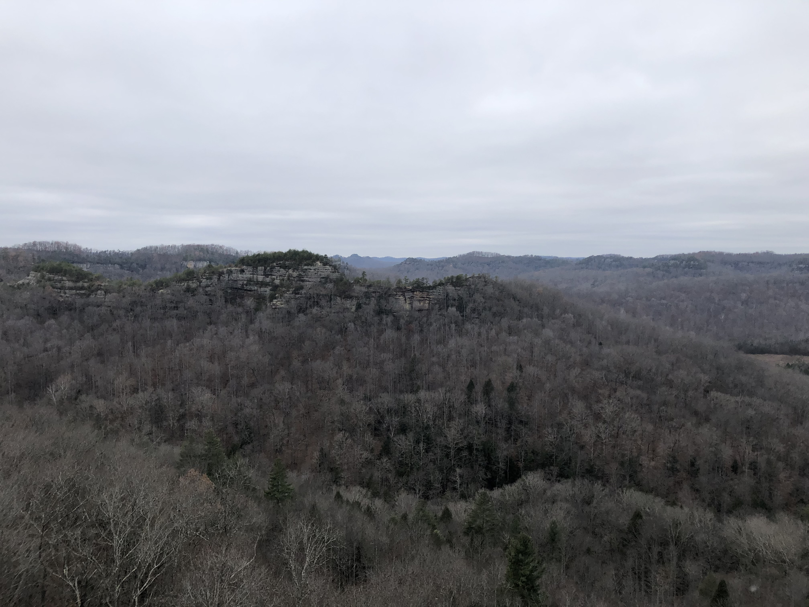

<!-- Heading 1 -->
# Field Report
<!-- Heading 2 -->
## Connor Ouellette, 12/3/2019, Courthouse Rock

For my field work project I selected Courthouse Rock in the Red River Gorge. The Courthouse Rock Trail is located in Powell County, Kentucky. The trail is 2.25 miles with a dirt and sand surface. The Courthouse Rock Trail is located within a loop on the Auxier Ridge Trail.

A view from the trail

A quick view of an over hanging outcrop along the trail

Stunning view of the ridge

Photo of the bridge to the left

Overlook of another ridge along the trail

Panorama from the top of the cliff