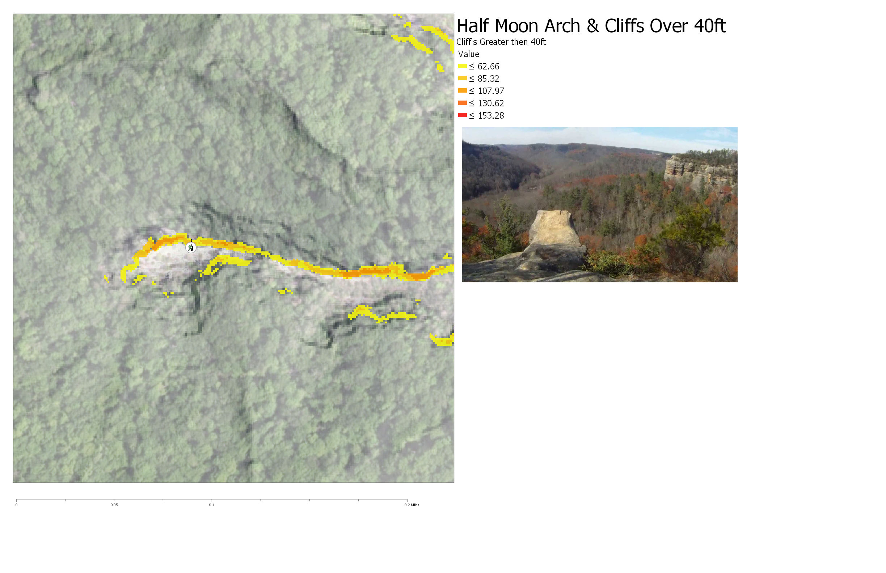

# Estimated cliff heights
<!-- [link to notebook](rrg.ipynb)    No notebook here -->

     
Half Moon Arch and Cliffs Over 40ft [click to enlarge](half_moon_300_DPI.jpg))

## Video
    
Bird's eye view of Half Moon [click to watch](https://www.youtube.com/embed/_K8HLk-7Zy0)
